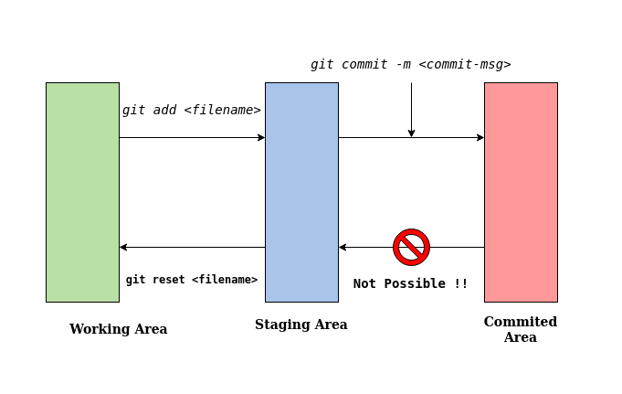

# hello-world
1st repository to get started with GitHub. This repo contains a set of handy git commands to enable beginners to get started with Open Source Development & Version Control.

### Basic Git Workflow:

0. #### First Time Setup ( After installing Git. )

    `git config --global user.name <your-name>`

     This name will be displayed against the commits you create.

    `git config --global user.email <your-registered-email>`

1. #### Intialize a new local git repository.

   `git init`

2. #### Adding a remote repository to push all your changes to GitHub.
    `git remote add origin <http-link-of-the-git-repo>`

3. #### Add files from working area to staging area.

    `git add  { <filename> | -A }` 

    Using the ' -A ' option instead of specifying a file name will transfer all the unstaged changes to the staging area.

4. #### Commit changes from the staging area to the final commited stage.

    #### NOTE: No further changes/modifications allowed after the changes are commited. 

    `git commit -m "<a-brief-message-about-the-commit>"`

5. #### View the status of staged and unstaged changes in your git repo.

    `git status`

6. #### View a history of the commits you've made to your repo.

    `git log`

7. #### Create a new git branch.

    `git branch <branch-name>`

8. #### Get a list of all the git branches in local repo.

    `git branch`

    Ex:

        git branch

        Lists all the local branches. 

        git branch -r 

        Lists all the branches in the Remote Repository.

        git branch -a

        Lists all local & remote branches.

9. #### Switch to a different git branch.

    `git checkout <branch-name>`

10. #### Fetch changes from the remote repo.

    `git pull origin`

## Best Practices:
Go through this document for a list of best practices while using git: [Best Practices](BEST_PRACTICES.md)
## Contributions

Contributions are welcome.

This guide is under active development and i will be adding newer commands as time progresses. Presently, i have only included those commands which are the bare minimum for getting started with version control. Meanwhile, if you find some other git command which you would want to include in this guide, feel free to open a pull request will all the necessary changes.

